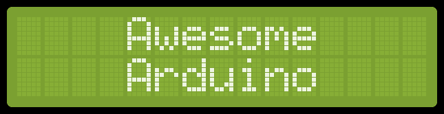

# Awesome Arduino  

Collections of awesome Arduino boards, projects, ideas etc.

## Contents
- [Official](#official)
- [Hardware](#️hardware)
- [Software](#software)
- [Projects](#projects)
- [Arduino-based Platforms](#arduino-based-platforms)
- [Resources](#resources)
- [Community](#community)

---

## Official

- [Website](https://arduino.cc)
- [Source Code](https://github.com/arduino/arduino)
- [IDE](https://www.arduino.cc/en/software)
- [Store](https://store.arduino.cc/usa/)

## Hardware 

### Boards 

- [Arduino Uno Rev3](https://store.arduino.cc/usa/arduino-uno-rev3)
- [Arduino Mega 2560 Rev3](https://store.arduino.cc/usa/mega-2560-r3)
- [Arduino Leonardo](https://store.arduino.cc/usa/leonardo)
- [Arduino Nano](https://store.arduino.cc/usa/arduino-nano)
- [Arduino Micro](https://store.arduino.cc/usa/arduino-zero)
- [Arduino Yún](https://store.arduino.cc/usa/arduino-yun)

### Shields

- [Arduino Education Shield](https://store.arduino.cc/usa/education-shield) - Educational purpose Arduino shield
- [Arduino Motor Shield Rev3](https://store.arduino.cc/usa/arduino-motor-shield-rev3) - Use DC motors with Arduino 
- [Arduino Ethernet Shield 2](https://store.arduino.cc/usa/arduino-ethernet-shield-2) - Connect your Arduino to internet ove ethernet
- [Adafruit Touch Shield for Arduino with Resistive Touch Screen](https://www.adafruit.com/product/1651) - Touch screen for Arduino
- [Adafruit 16-Channel 12-bit PWM/Servo Shield](https://www.adafruit.com/product/1411) - Control dozens of motors through I2C

## Software 

### IDE

- [Arduino IDE](https://github.com/arduino/Arduino) - Official Arduino IDE
- [Arduino Editor](https://create.arduino.cc/editor) - Official Online Arduino Editor
- [S4A](http://s4a.cat/) - Arduino can programmed over Scratch interface good for first begginers and kids.
- [Visual Studio Code extension for Arduino](https://marketplace.visualstudio.com/items?itemName=vsciot-vscode.vscode-arduino) - Arduino Extenstion for Visual Studio
- [Arduino IDE 2.x Beta](https://github.com/arduino/arduino-ide) - Beta Arduino IDE

### Simulators

- [Tinkercad](https://www.tinkercad.com/) - Very easy to use and learn directly from simulations.
  
### CAD

- [Fritzing](https://fritzing.org/) - Easy to use CAD software for prototyping Arduino circuits and creating PCB's.

### Useful Tools

- [Arduino CLI](https://github.com/arduino/arduino-cli) - Command line interface for Arduino sketches, libraries, boards, etc.
- [Putty](https://www.putty.org/) - Open-source serial console and terminal emulator
- [Johnny-Five](https://github.com/rwaldron/johnny-five) - The JavaScript robotics programming framework for Arduino
- [Blynk](https://github.com/blynkkk/blynk-library) - Popular IOT platform that can connect hardware (including Arduino) to cloud

## Projects 

- [Arduino Radar Project](https://www.youtube.com/watch?v=kQRYIH2HwfY) - Radar project with ultrasonic sensor and Fritzing
- [Potted Plant Protector](https://www.youtube.com/watch?v=B8F44CyJRRA) - Health monitoring of plants with Arduino
- [8x8x8 Led Cube](https://www.youtube.com/watch?v=T5Aq7cRc-mU) - Interactive 8x8x8 led cube build with Arduino
- [Wireless Arduino Powered Chess](https://www.youtube.com/watch?v=dX37LFv8jWY) - Wireless and mechnaical chess build with Arduino
- [Brainwave and Blink-Controlled Miniature Wheelchair](https://www.youtube.com/watch?v=iFBhTHGXcMQ) - #arduino-uno #android #neurosky
- [Powerful Electric Motorized Longboard](https://www.youtube.com/watch?v=XworvxoQleY) - Arduino powered diy electric longboard
- [Tele-Touch](https://www.youtube.com/watch?v=tMYQEaX3TbA) - Robotic system that mimicks user’s finger motions
- [Solar Tracker](https://www.youtube.com/watch?v=_6QIutZfsFs) - Solar panel that follow the movement of the sun throughout the day
- [Arduino Gimbal](https://www.youtube.com/watch?v=UxABxSADZ6U) - Educational purpose gimbal build with servos and gyroscope
- [Motorized Camera Slider](https://www.youtube.com/watch?v=hEBjbSTLytk) - Camera slider made with Arduino
- [Micro Servo Robot](https://www.youtube.com/watch?v=bLnAJ-mSElE&t=0s) - 4 axis robot arm with a small gripper and teach function
- [Stack Playing Robot](https://www.youtube.com/watch?v=uOsphjtf9Dk) - Simple robot that plays Stack Game
- [Arduino Drone](https://www.youtube.com/watch?v=if9LZTcy_uk) - Drones can be build from Arduino
- [Arduino Garden Controller](https://www.youtube.com/watch?v=O_Q1WKCtWiA) - Automatic watering and data logging and gardening
- [Arduino Soldering Station](https://www.youtube.com/watch?v=UvH49nzpJts) - Digital soldering station build with Arduino

## Arduino-based Platforms

- [Ardupilot](https://ardupilot.org/) - Versatile, Trusted, Open Autopilot software for drones and other autonomous systems
- [Marlin](https://marlinfw.org) - Marlin is an open source firmware for 3D printers.
- [mBot](https://www.makeblock.com/) - mBot is a low-cost and easy-to-use robot kit designed for children to use and learn to program.

## Resources

### Books

- [Arduino For Dummies](https://www.amazon.com/gp/product/1119489547)
- [Getting Started with Arduino](https://www.amazon.com/dp/1449363334)

### Talks

- [How Arduino is open-sourcing imagination](https://www.youtube.com/watch?v=UoBUXOOdLXY)
- [State of Arduino: Massimo Banzi at Maker Faire Bay Area 2019](https://www.youtube.com/watch?v=t1MN5o-qeyQ)

### Tutorials

#### Internals

- [An Introduction to the Arduino](https://www.youtube.com/watch?v=CqrQmQqpHXc)
- [Level Up Your Arduino Code](https://www.youtube.com/watch?v=mhSW_5iuy5k&list=PL1UO27YmKW8P8BlRTncqQ1x_wvFiHu8HI)
- [Library, Port Manipulation, Bit Math, Faster PWM/ADC](https://www.youtube.com/watch?v=EVm0qVJ56II) 

#### Software

- [C# to Arduino Communication](https://www.youtube.com/watch?v=vHeG3Gt6STE)
- [Processing to Arduino Communication](https://www.youtube.com/watch?v=yOMglntmmnA)

#### Hardware

- [Servos And How To Use Them With Arduino](https://www.youtube.com/watch?v=J8atdmEqZsc)
- [Stepper Motors and How To Use Them With Arduino](https://www.youtube.com/watch?v=bkqoKWP4Oy4)
- [How to Make Custom Shields for Your Microcontroller Board](https://www.youtube.com/watch?v=0Hw6-1Gk8eI)
- [How to Solder Properly](https://www.youtube.com/watch?v=VxMV6wGS3NY)

## Community

- [Arduino Forum](https://forum.arduino.cc/)
- [Arduino Stack Exchange](https://arduino.stackexchange.com/)
- [Discord Group](https://discord.gg/jQJFwW7)
- [Project Hub](https://create.arduino.cc/projecthub)
- [Reddit](https://www.reddit.com/r/arduino/)

## Contributing

Please see contributing file.
